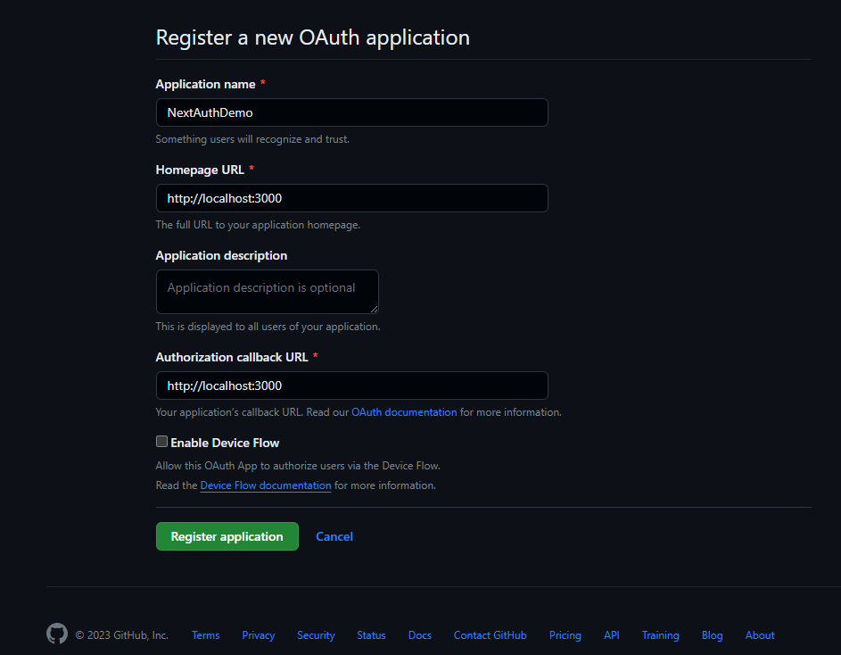

# <span style="color:cyan">69. NextAuth Setup</span>

Ref) &nbsp;https://velog.io/@dosomething/Next-auth-%EB%A5%BC-%EC%9D%B4%EC%9A%A9%ED%95%9C-%EB%A1%9C%EA%B7%B8%EC%9D%B8-%EA%B5%AC%ED%98%84  
&nbsp; &nbsp; &nbsp; &nbsp; https://blog.teamelysium.kr/nextjs-auth

<br />

<span style="color:cyan"><u>URL 접속에 의한</u> sign in/out 사용자 인증 </span>
-  GitHub 제공 OAuth App 이용

<br />

(from )

### [Step 1] 

&nbsp;1. &nbsp;<span style="color:orange"><b>기본 앱 구성</b></span>  
&nbsp; &nbsp; &nbsp; &nbsp;- &nbsp;`Navbar.js`, `Navbar.css`, `_app.js`, `blog.js`, `dashboard.js`


※ <span style="color:red">`<Link>` 와 `<a>` 동시 사옹 不可

```js
// components/Navbar.js

import Link from 'next/link'

function Navbar() {
  return (
    <nav className='nav'>
      <h1 className='logo'>
        <p href='#'>NextAuth</p>
      </h1>
      <ul className={`main-nav`}>
        <li>
          <Link href='/'>
            <p>Home</p>
          </Link>
        </li>
        <li>
          <Link href='/dashboard'>
            <p>Dashboard</p>
          </Link>
        </li>
        <li>
          <Link href='/blog'>
            <p>Blog</p>
          </Link>
        </li>
      </ul>
    </nav>
  )
}

export default Navbar
```

```css
/* components/Navbar.css */

ul {
  margin: 0;
  padding: 0;
  list-style: none;
}

p {
  color: #34495e;
}

.nav {
  background-color: #f4f4f4;
  box-shadow: 0px 0px 14px 0px rgba(0, 0, 0, 0.75);
  -webkit-box-shadow: 0px 0px 14px 0px rgba(0, 0, 0, 0.75);
  -moz-box-shadow: 0px 0px 14px 0px rgba(0, 0, 0, 0.75);
  padding-top: 0.5em;
  padding-bottom: 0.5em;
  display: flex;
  justify-content: space-between;
}

.logo {
  margin: 0;
  font-size: 1.45em;
}

.main-nav {
  display: flex;
  margin-top: 5px;
}

.logo p,
.main-nav p {
  padding: 10px 15px;
  text-transform: uppercase;
  text-align: center;
  /* display: block; */
}

.main-nav p {
  color: #34495e;
  font-size: 0.99em;
}

.main-nav p:hover {
  color: #718daa;
}
```

```js
// pages/_app.js

import Navbar from '../components/Navbar'
import '../styles/globals.css'
import '../components/Navbar.css'


function MyApp({ Component, pageProps }) {
  return (
    <>
      <Navbar />
      <Component {...pageProps} />
    </>
  );
}

export default MyApp
```
<br />

### [Step 2] 

<br />

&nbsp;2. &nbsp;<span style="color:orange"><b>NextAuth 설치 후, `pages/api` 폴더 內 `auth/[...nextauth].js` (catch all routes 파일) 생성</b></span>  
&nbsp; &nbsp; &nbsp; &nbsp;- &nbsp;`npm install next-auth`  
&nbsp; &nbsp; &nbsp; &nbsp;- &nbsp;인증 서비스 provider 로 GitHub 설정하나 다수 provider 설정 가능  


```js
// pages/api/auth/[...nextauth].js

import NextAuth from 'next-auth'
import GitHubProvider from 'next-auth/providers/github'

export default NextAuth({
  providers: [
    GitHubProvider({
      clientId: '',
      clientSecret: ''
    })
  ]
})

//? NextAuth() 본체가 없는데??
```
<br />

&nbsp;3. &nbsp;<span style="color:orange"><b>GitHub OAuth App 생성</b></span>  
&nbsp; &nbsp; &nbsp; &nbsp;1) &nbsp;GitHub 로그인 - 내 아이콘 - `Settings` 클릭  
&nbsp; &nbsp; &nbsp; &nbsp;2) &nbsp;왼쪽 사이드 바 메뉴 內 `Developer settings` - `OAuth Apps` - `Register a new application` 선택  
&nbsp; &nbsp; &nbsp; &nbsp;3) &nbsp;폼 기입 후 `Register application` 클릭  

<p style="text-align: center"></p>

&nbsp; &nbsp; &nbsp; &nbsp;4) &nbsp;`Client ID` 와 `Client secrets` 생성 확인  
&nbsp; &nbsp; &nbsp; &nbsp; &nbsp; &nbsp; &nbsp; &nbsp; -> &nbsp;<u>보안 위해 `.env.local`(환경변수 파일) 내 저장</u>

```
GITHUB_ID=98f594268383334d5e60
GITHUB_SECRET=bb0675a9109fba3dd29959424c8a803f3173787c
```
<br />

&nbsp;4. &nbsp;<span style="color:orange"><b>`[...nextauth].js` (catch all routes 파일) 마무리</b></span>  
&nbsp; &nbsp; &nbsp; &nbsp;- &nbsp;GitHub OAuth App 정보 기입

```js
// pages/api/auth/[...nextauth].js

import NextAuth from 'next-auth'
import GitHubProvider from 'next-auth/providers/github'

export default NextAuth({
  providers: [
    GitHubProvider({
      clientId: process.env.GITHUB_ID,
      clientSecret: process.env.GITHUB_SECRET
    })
  ]
})

//? NextAuth() 본체가 없는데??
```

<br />

&nbsp;5. &nbsp;<span style="color:orange"><b>GitHub OAuth App (= NextAuthDemo) 작동 확인</b></span>  
&nbsp; &nbsp; &nbsp; &nbsp;1) &nbsp;`npm run dev`  
&nbsp; &nbsp; &nbsp; &nbsp;2) &nbsp;<u><b>Sign in</b></u>  
&nbsp; &nbsp; &nbsp; &nbsp; &nbsp; &nbsp; &nbsp; &nbsp;- &nbsp;`localhost://3000/api/auth/signin` 접속  
&nbsp; &nbsp; &nbsp; &nbsp; &nbsp; &nbsp; &nbsp; &nbsp;- &nbsp;GitHub 에 의해 Sign-in 버튼 UI 제공됨 (유저 커스터마이즈 가능)  
&nbsp; &nbsp; &nbsp; &nbsp; &nbsp; &nbsp; &nbsp; &nbsp;- &nbsp;클릭 - (Authorize) 이후 홈페이지로 리다이렉트  
&nbsp; &nbsp; &nbsp; &nbsp; &nbsp; &nbsp; &nbsp; &nbsp; &nbsp; &nbsp; &nbsp; &rarr; &nbsp;<span style="color:cyan">`DevToos` 에서 next-auth session token 쿠키 생성 확인</span>  
&nbsp; &nbsp; &nbsp; &nbsp;3) &nbsp;<u><b>Sign out</b></u>  
&nbsp; &nbsp; &nbsp; &nbsp; &nbsp; &nbsp; &nbsp; &nbsp;- &nbsp;`localhost://3000/api/auth/signout` 접속  
&nbsp; &nbsp; &nbsp; &nbsp; &nbsp; &nbsp; &nbsp; &nbsp;- &nbsp;GitHub 에 의해 Sign-out 버튼 UI 제공됨 (유저 커스터마이즈 가능)  
&nbsp; &nbsp; &nbsp; &nbsp; &nbsp; &nbsp; &nbsp; &nbsp;- &nbsp;클릭 시 홈페이지로 리다이렉트  
&nbsp; &nbsp; &nbsp; &nbsp; &nbsp; &nbsp; &nbsp; &nbsp; &nbsp; &nbsp; &nbsp; &rarr; &nbsp;<span style="color:cyan">`DevToos` 에서 next-auth session token 쿠키 삭제 확인</span>  

<br />